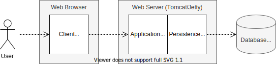

# Project Academia

**[1. Architecture](#1-architecture)**  
**[2. Installation](#2-installation)**  
[2.1 PostgreSQL Database](#21-postgresql-database)  
[2.2 Tomcat Web Server](#22-tomcat-web-server)  
**[3. Build and Run](#3-build-and-run)**  
[3.1 Production](#31-production)  
[3.2 Testing](#32-testing)  
**[4. Remarks](#4-remarks)**  
[4.1 Persistence](#41-persistence)  
[4.2 Testing](#42-testing)  
[4.3 Continuous Integration](#43-continuous-integration)

## 1. Architecture

In the **Academia** project, a student administration software is developed. The software has a 3-tier architecture,
consisting of a web browser, a web server and a database server.



In the web browser, a JavaScript client runs. In the web server, a Java application with a layer architecture runs:

- The *application layer* provides a REST interface and implements the application logic (using Servlets)
- The *persistence layer* implements the data access (using JDBC)

For production, a [Tomcat](https://tomcat.apache.org/) web server and a [PostgreSQL](https://www.postgresql.org/)
database are used. For testing, an embedded [Jetty](https://www.eclipse.org/jetty/) web server and the
in-memory [H2](https://h2database.com/) database are used.

## 2. Installation

### 2.1 PostgreSQL Database

- Download the PostgreSQL Database software from https://www.postgresql.org/download/
- Install the software using **postgres** as superuser password and **5432** as server port
- Set the environment variable `POSTGRES_HOME` to the installation directory and add its `bin` subdirectory to the
  system path, e.g.
  ```
  set POSTGRES_HOME=C:\Program Files\PostgreSQL\14
  set PATH=%PATH%;%POSTGRES_HOME%\bin
  ```
- Start the database server if it is not already running
  ```
  pg_ctl start -D "%POSTGRES_HOME%\data"
  ```
- Create the Academia database
  ```
  createdb -U postgres academia
  ```
- Create the Academia database tables and insert data
  ```
  psql -U postgres -d academia -f src/etc/db-create.sql
  psql -U postgres -d academia -f src/etc/db-init.sql
  ```
- Run the PostgreSQL interactive terminal and test the data
  ```
  psql -U postgres academia
  academia=# SELECT * FROM module;
  exit
  ```  
- Stop the database server when finished with the project
  ```
  pg_ctl stop
  ```

Further information can be found in the [PostgreSQL documentation](https://www.postgresql.org/docs/13/index.html).

For MacOS it is recommended to install PostgreSQL using [Homebrew](https://formulae.brew.sh/formula/postgresql).
Afterwards, the database server can be started with `pg_ctl -D /usr/local/var/postgres start`

#### 2.1.1 Docker (optional)
Docker can be used to easily set up the postgres local test deployment.

```bash
# start local postgresql container
docker run -it -p 5432:5432 -d -e POSTGRES_HOST_AUTH_METHOD=trust -e POSTGRES_DB=academia --name=postgres postgres

# copy init sql scripts
docker cp src/etc/db-create.sql postgres:/
docker cp src/etc/db-init.sql postgres:/

# execute the copied init sql scripts inside the container
docker exec -it postgres psql -U postgres -d academia -f /db-create.sql
docker exec -it postgres psql -U postgres -d academia -f /db-init.sql

# test data
docker exec -it postgres psql -U postgres -d academia -- psql
academia=# SELECT * FROM module;
```
### 2.2 Tomcat Web Server

- Download and extract the ZIP archive of Tomcat 10 from https://tomcat.apache.org/download-10.cgi
- Set the environment variable `CATALINA_HOME` to the installation directory and its `bin` subdirectory to the system
  path, e.g.
  ```
  set CATALINA_HOME=C:\apache-tomcat-10.0.16
  ```
- Start the Tomcat server
  ```
  %CATALINA_HOME%\bin\startup
  ```

Further information can be found in the [Tomcat documentation](https://tomcat.apache.org/tomcat-10.0-doc/index.html).

## 3. Build and Run

The Maven configuration allows building, testing and documenting the application. Unit tests as well as integration
tests can be executed.

### 3.1 Production

For production, the application is compiled and packaged into a web archive (WAR file). This web archive can then
deployed to a running Tomcat web server.

- Generate the application documentation
  ```
  mvn site
  ```
- Build the application creating a web archive
  ```
  mvn package
  ```
- Copy the web archive to the Tomcat server
  ```
  copy target\academia-1.0-SNAPSHOT.war %CATALINA_HOME%\webapps\ROOT.war
  ```
- Open a web browser at [http://localhost:8080](http://localhost:8080) and test the application

### 3.2 Testing

For testing, the application is run using an embedded Jetty web server and the in-memory database H2. The class `DBUtil`
can be used to run SQL scripts before and after the tests.

Usage:

- Execute the unit tests
  ```
  mvn test
  ```
- Execute the unit and integration tests
  ```
  mvn verify
  ```
- Execute the tests and generate the documentation including the test reports
  ```
  mvn verify site
  ```

### 3.3 Docker

*install docker desktop*: https://docs.docker.com/desktop/ \
*install docker-compose*: https://docs.docker.com/compose/install/

You can build the whole stack with `docker-compose`. \
Just head to the root directory of this repository and enter the following command:

```bash
docker-compose up -d
```

Or simply run the `test.sh` script. \
It will automatically check if docker and docker-compose is installed on your machine and if not it will install it directly.
```bash
chmod +x test.sh
sudo ./test.sh
```


## 4. Remarks

### 4.1 Persistence

- When writing to the database, the corresponding connection (and thus the underlying transaction) must be committed or
  rolled back before closing it.
- Since two different databases are involved (PostgreSQL and H2), only standard SQL queries may be used.

### 4.2 Testing

There are two types of tests:

- Unit tests (with suffix `Test`) are used to test single classes and do not require any infrastructure and are executed
  during the Maven `test` phase.
- Integration tests (with suffix `IT`) are used to test the interaction of software components and the infrastructure,
  and are executed during the Maven `integration-test`phase, e.g.
	- `ModuleRepositoryIT` tests the database access implemented in the `ModuleRepository`
	- `ModuleControllerIT` tests the REST interface implemented in the `ModuleController`

### 4.3 Continuous Integration

When pushing onto the master branch, a GitLab pipeline is activated which executes the Maven build, unit testing,
integration testing and documentation phases. On success the generated documentation is published on GitLab Pages.
