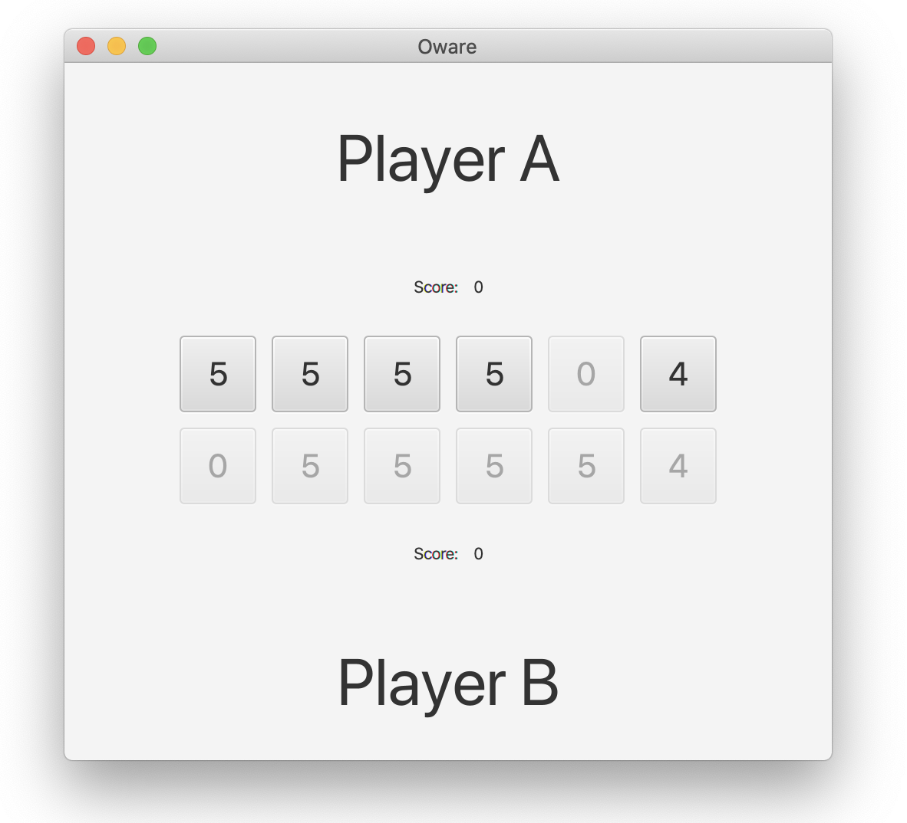
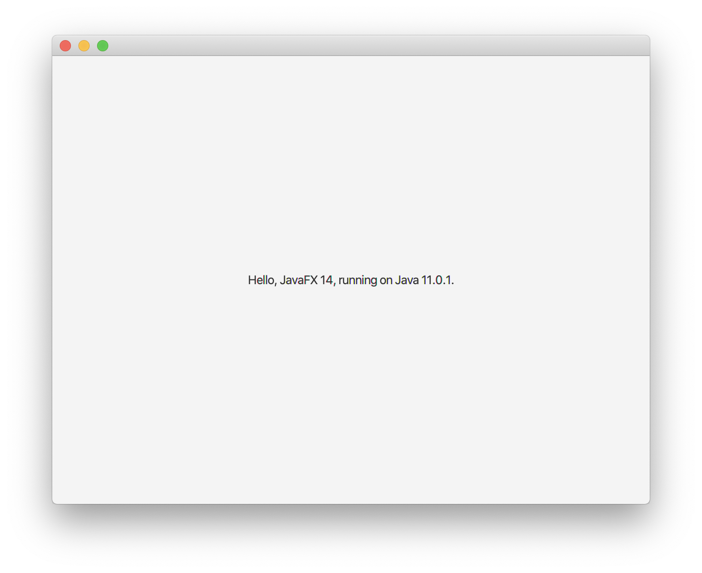

# Oware Game


## Introduction

The goal of this project is to develop a program to play the Oware game. Oware is a two-player board game played in different parts of the world under different names (Awari, Ouril, etc.) and with slightly different rules. In this project, we consider a simplified version of the Oware game.


## Game Board and Basic Rules

The game board usually consists of two rows of six pits. Each row belongs to a player. The game starts with 4 seeds in each of the 12 pits (48 seeds in total).

```
Player A:  |4|4|4|4|4|4|
Player B:  |4|4|4|4|4|4|
```

The two players play in turns. At each turn, a player chooses one of his pits (which must contain at least one seed) and distributes the seeds clockwise around the board. We number the pits as shown in the above picture, for example A2 for the second pit from the left in the the upper row (which belongs to Player A).

### Example

Player A starts the game by playing A5:

```
Player A:  |4|4|4|4|0|5|
Player B:  |4|4|4|5|5|5|
Score 0/0
```

Player B plays B6:

```
Player A:  |5|5|5|5|0|5|
Player B:  |0|4|4|5|5|5|
Score 0/0
```

Player A plays A4:

```
Player A:  |5|5|5|0|1|6|
Player B:  |0|4|4|6|6|6|
Score 0/0
```

Player B plays B4:

```
Player A:  |6|6|5|0|1|6|
Player B:  |1|5|0|6|6|6|
Score 0/0
```

## Object and End of the Game

The goal of the game is to steal seeds from the opponent's pits. Seeds can be stolen by placing a second seed into an apponent's pit that contains a single seed only (in other words, pits with a single seed are unprotected). If this happens, both seeds are removed from the pit and added to the player's score.

### Example (cont.)

Player A plays A6 and steals Player B's seed in B6. The score now is 2/0 in favour of Player A and 46 seeds remain in the game:

```
Player A:  |6|6|5|0|1|0|
Player B:  |0|6|1|7|7|7|
Score 2/0
```

Player B plays B5 and takes Player A's seed in A5. The score now is 2/2 and 44 seeds remain in the game:

```
Player A:  |7|7|6|1|0|0|
Player B:  |1|0|1|7|7|7|
Score 2/2
```

The game ends if only 2 seeds remain in the game. Therefore, the possible final scores in the default game setting are 0/46, 2/44 to 46/0. Note that there is always a winner.

## Remarks

- Sometimes, more than one seed can be stolen simultaneously in different pits of the opponent.
- If all pits of a player are empty, the other player can play multiple times, until the first player gets a seed.
- If a large number of seeds are in the same pit, distributing the seeds may go over more multiple rows.
- There is always a strategy to reach the final state with only 2 seeds remaining.


## Tasks

* Create a class diagram that models the data and logic of the game. In the center of that diagram must be a class that represents the Oware game board (the two rows of pits and the seeds). This class must implement the given Java interface <code>Board</code>. The methods of that interface are described in its JavaDoc. 
* Implement and test the game logic. Make sure that that your game board class supports different boards sizes (number of pits in each row) and different numbers of initial seeds in each pit. The class representing the game board must pass all JUnit tests from the file <code>BoardTest</code> (you may need to adjust the class names in the test file to match with the name of your class). 
* Implement the game as a console app such that two human players can play against each other by entering their moves into the console. A game played like this could look as follows:

```
Player A:  | 4| 4| 4| 4| 4| 4|
Player B:  | 4| 4| 4| 4| 4| 4|
Score 0/0

Player A: moves = [1, 2, 3, 4, 5, 6]
Enter move => 5

Player A:  | 4| 4| 4| 4| 0| 5|
Player B:  | 4| 4| 4| 5| 5| 5|
Score 0/0

Player B: moves = [1, 2, 3, 4, 5, 6]
Enter move => 6

Player A:  | 5| 5| 5| 5| 0| 5|
Player B:  | 0| 4| 4| 5| 5| 5|
Score 0/0

Player A: moves = [1, 2, 3, 4, 6]
Enter move => 
```
* Implement one or multiple bot players with different simple playing strategies (e.g. select a random non-empty pit, select the non-empty pit with the lowest or highest number of seeds, etc.). No advanced game playing algorithms are expected. 
* Implement the bot players into the console app, such a human player can play against a bot player, or that two bot players can play against each other in a simulation. A game against a bot player could look as follows:

```
Player A:  | 4| 4| 4| 4| 4| 4|
Player B:  | 4| 4| 4| 4| 4| 4|
Score 0/0

Player A: moves = [1, 2, 3, 4, 5, 6]
Enter move => 5

Player A:  | 5| 4| 4| 4| 0| 5|
Player B:  | 5| 5| 5| 6| 0| 5|
Score 0/0

Player A: moves = [1, 2, 3, 4, 6]
Enter move => 6

Player A:  | 6| 5| 5| 5| 0| 0|
Player B:  | 6| 7| 7| 0| 1| 6|
Score 0/0

Player A: moves = [1, 2, 3, 4]
Enter move => 4

Player A:  | 6| 5| 5| 0| 1| 1|
Player B:  | 6| 7| 8| 0| 0| 7|
Score 2/0

Player A: moves = [1, 2, 3, 5, 6]
Enter move => 
```

* Implement a JavaFx user interface that visualizes the board, displays the
  score and allows the players to choose the pits to play. The JavaFx app could look as follows:




## Evaluation Criteria

These are the evaluation criteria:

* Correct implementation of the game logic (all provided test pass)
* A running console application
* A running JavaFX application

To pass, two out of the three criteria above must be fulfilled.


## Importing the Project into Eclipse

Git-clone the sample application. Then import the application as a
Maven project ("Import..." -> "Maven" -> "Existing Maven Projects").

**Executing the given initial applications:** To run the sample
JavaFX application, select the Java source
file `JavaFXApp.java`, right-click and
select "Run As" -> "Java Application".

Initially, the sample application shows a simple window:



It is also possible to execute the sample console application given, too.
Select the Java source file `ConsoleApp.java`, right-click and
select "Run As" -> "Java Application".


**Executing the tests:** It is also possible to execute the sample JUnit test class `BoardTest` given
in the test directory. Select the Java source
file `BoardTest.java`, right-click and
select "Run As" -> "JUnit Test".


## Importing the Project into IntelliJ

Git-clone the sample application. Then open/import the application
("Open or import" then navigate to the root of the sample
application).

**Executing the given initial applications:** To run the sample application,
select the Java source
file `JavaFXApp.java`, right-click and
select "Run 'JavaFXApp.main()' ".

A window as shown above will be displayed.

It is also possible to execute the sample console application given, too.
Select the Java source file `ConsoleApp.java`, right-click and
select "Run 'ConsoleApp.main()' ".


**Executing the tests:** It is also possible to execute the
sample JUnit test class `BoardTest` given
in the test directory. Select the Java source
file `BoardTest.java`, right-click and
select "Run 'BoardTest' ".


## For Advanced Users: Maven Project

A working Maven project with JavaFX dependencies is given. To import it into your favorite IDE, just import (in Eclipse) or open (in IntelliJ) the project. No prior JavaFX or Java module setup is required.

To compile and build the project with Maven, type:

```console
mvn clean package
...
```

To execute the JavaFX app, first build the project (see above), then type:

```console
mvn javafx:run
...
```

To execute the console app, first build the project (see above), then type:

```console
mvn exec:java
...
```

To generate Javadoc API documentation, type:

```console
mvn clean compile javadoc:javadoc
...
```

You will find the generated HTML files in `./target/site/apidocs`. In your browser, open
file `./target/site/apidocs/index.html`.

> **Note:** To generate the Javadoc API documentation, you must
> type `mvn clean compile javadoc:javadoc` as Javadoc requires the
> compilation of the Java source files.


To run Checkstyle for checking the code quality, type:

```console
mvn checkstyle:check
```


