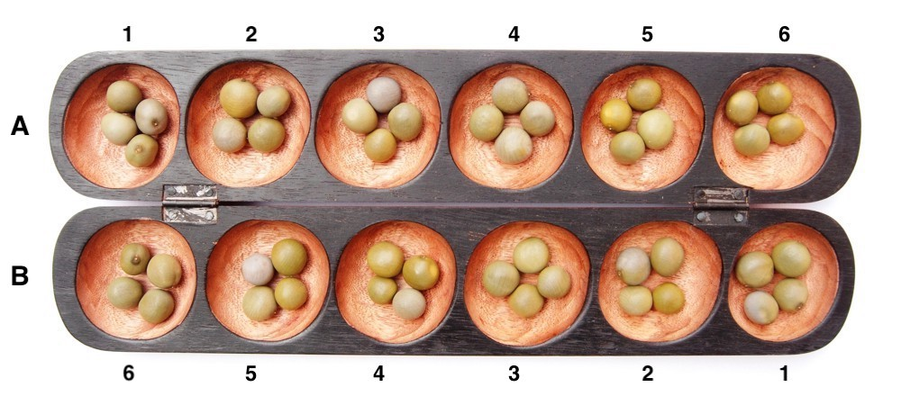

# Oware Game


## Introduction

The goal of this project was to develop a program to play the Oware game. Oware is a two-player board game played in different parts of the world under different names (Awari, Ouril, etc.) and with slightly different rules. In this project, we consider a simplified version of the Oware game.




## Game Board and Basic Rules

The game board usually consists of two rows of six pits. Each row belongs to a player. The game starts with 4 seeds in each of the 12 pits (48 seeds in total).

```
Player A:  |4|4|4|4|4|4|
Player B:  |4|4|4|4|4|4|
```

The two players play in turns. At each turn, a player chooses one of his pits (which must contain at least one seed) and distributes the seeds clockwise around the board. We number the pits as shown in the above picture, for example A2 for the second pit from the left in the the upper row (which belongs to Player A).

### Example

Player A starts the game by playing A5:

```
Player A:  |4|4|4|4|0|5|
Player B:  |4|4|4|5|5|5|
Score 0/0
```

Player B plays B6:

```
Player A:  |5|5|5|5|0|5|
Player B:  |0|4|4|5|5|5|
Score 0/0
```

Player A plays A4:

```
Player A:  |5|5|5|0|1|6|
Player B:  |0|4|4|6|6|6|
Score 0/0
```

Player B plays B4:

```
Player A:  |6|6|5|0|1|6|
Player B:  |1|5|0|6|6|6|
Score 0/0
```

## Object and End of the Game

The goal of the game is to steal seeds from the opponent's pits. Seeds can be stolen by placing a second seed into an apponent's pit that contains a single seed only (in other words, pits with a single seed are unprotected). If this happens, both seeds are removed from the pit and added to the player's score.

### Example (cont.)

Player A plays A6 and steals Player B's seed in B6. The score now is 2/0 in favour of Player A and 46 seeds remain in the game:

```
Player A:  |6|6|5|0|1|0|
Player B:  |0|6|1|7|7|7|
Score 2/0
```

Player B plays B5 and takes Player A's seed in A5. The score now is 2/2 and 44 seeds remain in the game:

```
Player A:  |7|7|6|1|0|0|
Player B:  |1|0|1|7|7|7|
Score 2/2
```

The game ends if only 2 seeds remain in the game. Therefore, the possible final scores in the default game setting are 0/46, 2/44 to 46/0. Note that there is always a winner.

## Remarks

- Sometimes, more than one seed can be stolen simultaneously in different pits of the opponent.
- If all pits of a player are empty, the other player can play multiple times, until the first player gets a seed.
- If a large number of seeds are in the same pit, distributing the seeds may go over more multiple rows.
- There is always a strategy to reach the final state with only 2 seeds remaining.

## Java version

We recommend using Java 11+ (although everything from java 8 and onwards should work just fine)

## Authors

Oliver Aemmer
Ciril Hofer
Till Imstepf

